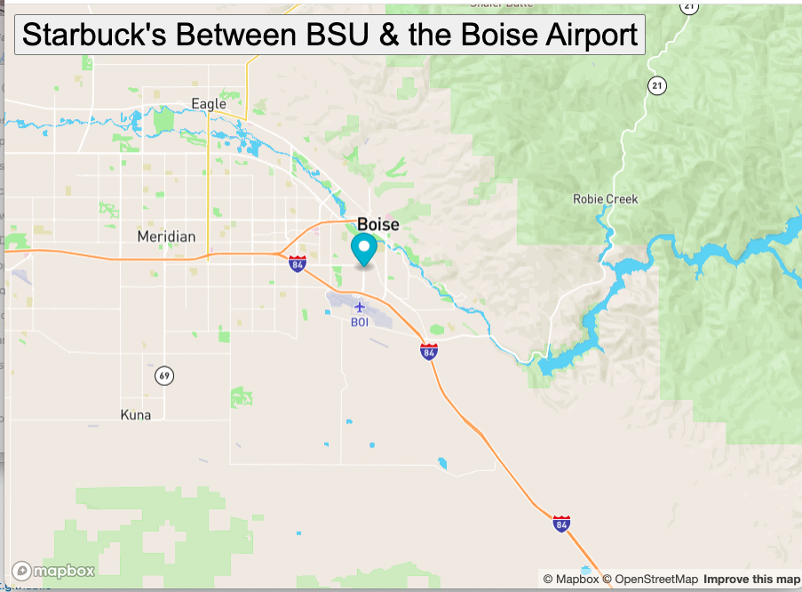

# bus-tracker
## Description
This program starts at Boise State University and it stops at the Starbuck's between BSU and the Boise airport
Click on the heading at the top and it will move along the path.  
## Roadmap of future improvement
This is a pretty basic program.  With this type of program more can definitly be done. 

## To run the program
In the upper portion of this screen there is a green button labeled code.
Click on that button.
A dropdown box will appear.
Download the zip file.
Open the zip file.
Drag and drop the html file onto a browser page

